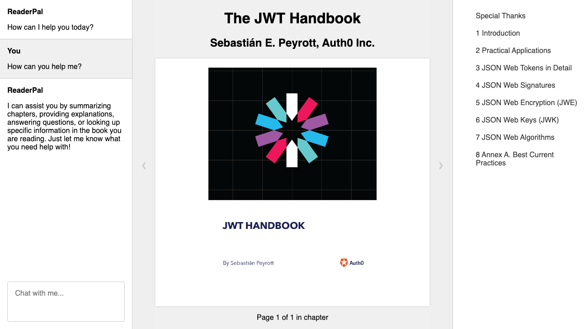

# ReaderPal

> **Note:** This project is currently a work in progress.

ReaderPal is a minimal web-based ePub reader that comes with an AI companion, enhancing your reading experience and helping you understand books better.

## Project Roadmap

ReaderPal is designed as a standalone client-side application, with no immediate plans for backend integration. The following features are planned for ReaderPal:

- [x] Basic ePub reader
- [x] AI companion
- [ ] User input for OpenAI API key
- [ ] ePub file upload
- [ ] Save and resume functionality for book, reading progress, and AI companion state
- [ ] Customizable AI companion

Long-term goals include:

- [ ] Search functionality within books
- [ ] Bookmarking feature
- [ ] Highlighting and note-taking tools
- [ ] Customizable ebook themes
- [ ] Cloud synchronization (?)

## Important Note

To utilize the AI companion feature, you'll need to supply your own OpenAI API key. We assure you that this key is stored exclusively in your browser's local storage and is not transmitted to any server, except for OpenAI's API.

Please be aware that our AI companion is powered by OpenAI's GPT-3, a sophisticated language model. While it's capable of generating human-like text, it may occasionally produce responses that are incorrect or inappropriate.

"The JWT Handbook" by Sebastián E. Peyrott, Auth0 Inc. is included as a sample book for demonstration purposes only.

---

Happy reading with ReaderPal!
